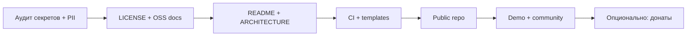

# План публикации открытого исходного кода

**Проект:** Периодизация / Training Calculator (`react-project`)  
**Репозиторий:** https://github.com/alien177122/react-project  
**Регион:** Казахстан  
**Дата плана:** 2026-06-17  
**Ориентир по срокам:** 3–4 недели (в свободное время)

---

## Содержание

1. [Цель и принципы](#цель-и-принципы)
2. [Фаза 0 — Решения до кода](#фаза-0--решения-до-кода-1-2-дня)
3. [Фаза 1 — Аудит безопасности](#фаза-1--аудит-безопасности-2-3-дня--критично)
4. [Фаза 2 — Юридическая упаковка OSS](#фаза-2--юридическая-упаковка-oss-1-день)
5. [Фаза 3 — Структура репозитория и документация](#фаза-3--структура-репозитория-и-документация-2-3-дня)
6. [Фаза 4 — CI/CD и качество для contributors](#фаза-4--cicd-и-качество-для-contributors-1-2-дня)
7. [Фаза 5 — Публикация (go public)](#фаза-5--публикация-go-public-1-день)
8. [Фаза 6 — Сообщество и сопровождение](#фаза-6--сообщество-и-сопровождение-после-public)
9. [Дорожная карта](#дорожная-карта)
10. [Риски](#риски)
11. [Чеклист перед public](#чеклист-перед-public)
12. [Приложение A — Добровольная поддержка (Kaspi)](#приложение-a--добровольная-поддержка-kaspi)

---

## Цель и принципы

**Главная цель:** опубликовать **полноценный open source проект** — публичный репозиторий, лицензия MIT, воспроизводимая сборка, документация для contributors, CI, безопасная история git.

**Не цель:** монетизация или донаты как условие публикации. Финансовая поддержка — **опциональное приложение** после того, как код открыт и проектом можно пользоваться.

### Принципы open source для этого репозитория

| Принцип          | Что это значит на практике                            |
| ---------------- | ----------------------------------------------------- |
| **Reproducible** | `bun install && bun run dev` работает на чистом clone |
| **Licensed**     | `LICENSE` (MIT) в корне — без него код не OSS         |
| **Safe**         | Нет PII, секретов и `gym.db` в git и истории          |
| **Documented**   | README, CONTRIBUTING, ARCHITECTURE, DEPLOYMENT        |
| **Welcoming**    | Issue/PR templates, CODE_OF_CONDUCT                   |
| **Maintained**   | CI (typecheck, lint, test, gitleaks) на каждый PR     |

### Что открываем / что не публикуем

| В git (public)                        | Не в git (`.gitignore`)                    |
| ------------------------------------- | ------------------------------------------ |
| `src/`, `server/`, `packages/shared/` | `.env*`, кроме `*.example`                 |
| `platforms/*`                         | `gym.db`, `*.sqlite`                       |
| `docs/`, `STRUCTURE.md`               | `workspace-files/`                         |
| `.github/` workflows и templates      | Личные заметки, scratch                    |
| `bun.lockb`                           | `.cursor/`, `memory-bank/` (agent tooling) |

`memory-bank/`, `.cursor/`, `_meta/` — **не коммитить** в публичный репозиторий; при необходимости кратко описать в README, что это локальный dev/agent контекст.

---

## Фаза 0 — Решения до кода (1–2 дня)

| Вопрос                           | Решение                                                                 |
| -------------------------------- | ----------------------------------------------------------------------- |
| Лицензия                         | **MIT**                                                                 |
| Язык README                      | **English primary** (`README.md`); `README.ru.md` — опционально         |
| Ветка по умолчанию               | `main`                                                                  |
| Минимальная версия для поддержки | `latest` (см. SECURITY.md)                                              |
| Демо                             | Vercel (frontend) + отдельный API-хост                                  |
| Донаты                           | Отложить до [Приложения A](#приложение-a--добровольная-поддержка-kaspi) |

### Чеклист фазы 0

- [ ] Подтверждена лицензия MIT
- [ ] Решено: EN или EN+RU для README
- [ ] Определён URL публичного demo
- [ ] Согласован список директорий в `.gitignore` (включая agent tooling)

---

## Фаза 1 — Аудит безопасности (2–3 дня) ⚠️ критично

**Блокер:** пока аудит не пройден — репозиторий **не** переводить в public. Любая утечка PII из `gym.db` в истории git — риск по закону РК «О персональных данных».

### 1.1 Автоматическое сканирование секретов

```bash
bunx gitleaks detect --source . --verbose
```

Порядок при находках:

1. Отозвать скомпрометированный секрет (не только удалить из кода).
2. Убрать из текущего дерева и из истории git.
3. Повторить `gitleaks` до чистого прохода.

### 1.2 PII в `gym.db`

```bash
sqlite3 gym.db "SELECT COUNT(*) FROM users;"
sqlite3 gym.db "SELECT COUNT(*) FROM workouts;"
```

| Результат   | Действие                                                               |
| ----------- | ---------------------------------------------------------------------- |
| 0 записей   | Удалить `gym.db` из git, добавить `server/seed.sql` с демо-данными     |
| Есть данные | **Не публиковать** до полной очистки истории; заменить на seed без PII |

### 1.3 Очистка истории git

```bash
# pip install git-filter-repo  (если нет)
git filter-repo --invert-paths \
  --path gym.db \
  --path .DS_Store \
  --path workspace-files/

# Проверка
git log --all --full-history -- gym.db .env* *.key *.pem
```

> `memory-bank/` и `.cursor/` — добавить в `.gitignore` и убрать из истории, если уже коммитились.

### 1.4 Расширенный `.gitignore`

```gitignore
# Agent / local dev
.cursor/
memory-bank/
workspace-files/

# OS
.DS_Store
Thumbs.db

# Secrets
.env*
!.env.docker.example
!.env.public.example
!.env.production.example
*.key
*.pem

# Database
gym.db
*.db
*.sqlite
*.sqlite3

# Build
node_modules/
dist/
```

### 1.5 Ручной аудит

```bash
rg -i 'api[_-]?key|secret|password|token|Bearer|private[_-]?key' \
  --glob '!node_modules' --glob '!dist'

git ls-files | grep -E '\.(db|sqlite|key|pem)$'
```

### 1.6 Известные артефакты проекта

| Артефакт                          | Статус                                      |
| --------------------------------- | ------------------------------------------- |
| `JWT_SECRET=dev` в `package.json` | OK для локалки; в README: не для production |
| `debug.keystore` (Android)        | OK — debug, не production                   |
| Cloudflare tunnel token           | Только в `.env.public` (ignored)            |
| `bun.lockb`                       | **Должен** быть в git                       |

### 1.7 Данные для contributors

- [ ] `server/seed.sql` или `bun run db:seed` — без PII
- [ ] Инструкция в `CONTRIBUTING.md`

### Чеклист фазы 1

- [ ] `gitleaks` — чистый проход
- [ ] `gym.db` удалён из дерева и истории
- [ ] 0 реальных пользователей в seed/истории
- [ ] `.gitignore` обновлён
- [ ] `git ls-files` без `.db` / секретов
- [ ] `bun.lockb` в git

---

## Фаза 2 — Юридическая упаковка OSS (1 день)

### Обязательные файлы

| Файл                 | Назначение                                          |
| -------------------- | --------------------------------------------------- |
| `LICENSE`            | MIT, copyright `alien177122`, 2026                  |
| `README.md`          | EN: описание, demo, quick start, badges, license    |
| `README.ru.md`       | RU (опционально)                                    |
| `CONTRIBUTING.md`    | Fork, branch, PR, тесты, code style                 |
| `SECURITY.md`        | Как сообщать об уязвимостях (не через public issue) |
| `CODE_OF_CONDUCT.md` | Contributor Covenant v2.1                           |
| `CHANGELOG.md`       | [Keep a Changelog](https://keepachangelog.com/)     |
| `.editorconfig`      | indent 2, utf-8, final newline                      |
| `.env.*.example`     | Полные шаблоны без секретов                         |

### LICENSE (MIT) — шаблон

```
MIT License

Copyright (c) 2026 alien177122

Permission is hereby granted, free of charge, to any person obtaining a copy
of this software and associated documentation files (the "Software"), to deal
in the Software without restriction, including without limitation the rights
to use, copy, modify, merge, publish, distribute, sublicense, and/or sell
copies of the Software, and to permit persons to whom the Software is
furnished to do so, subject to the following conditions:

The above copyright notice and this permission notice shall be included in all
copies or substantial portions of the Software.

THE SOFTWARE IS PROVIDED "AS IS", WITHOUT WARRANTY OF ANY KIND, EXPRESS OR
IMPLIED, INCLUDING BUT NOT LIMITED TO THE WARRANTIES OF MERCHANTABILITY,
FITNESS FOR A PARTICULAR PURPOSE AND NONINFRINGEMENT.
```

### SECURITY.md — ключевые пункты

- **Не** открывать public issue для security bugs
- Email или Telegram для отчётов
- Acknowledgment: 48 часов
- Coordinated disclosure после фикса
- Scope: API, JWT, SQLite, PWA storage

### Чеклист фазы 2

- [ ] `LICENSE`, `CONTRIBUTING.md`, `SECURITY.md`, `CODE_OF_CONDUCT.md`, `CHANGELOG.md`
- [ ] `.editorconfig`
- [ ] Все `.env.*.example` актуальны

---

## Фаза 3 — Структура репозитория и документация (2–3 дня)

### Целевая структура

```
react-project/
├── README.md                 # EN primary
├── README.ru.md              # optional
├── LICENSE
├── CONTRIBUTING.md
├── SECURITY.md
├── CODE_OF_CONDUCT.md
├── CHANGELOG.md
├── STRUCTURE.md
├── .editorconfig
├── .gitignore
├── .env.docker.example
├── .env.public.example
├── docs/
│   ├── open-source-plan.md   # этот файл
│   ├── ARCHITECTURE.md       # схема: web + API + shared + platforms
│   ├── DEPLOYMENT.md         # self-hosting, Docker, Vercel
│   └── screenshots/
│       ├── desktop.png
│       └── mobile.png
├── .github/
│   ├── workflows/
│   │   └── ci.yml
│   ├── ISSUE_TEMPLATE/
│   │   ├── bug_report.md
│   │   └── feature_request.md
│   ├── PULL_REQUEST_TEMPLATE.md
│   └── CODEOWNERS
├── src/
├── server/
├── packages/
└── platforms/
```

### README.md — обязательные секции (OSS-first)

1. **Название + badges** — CI, License MIT
2. **Demo** — ссылка на Vercel
3. **Screenshots** — `docs/screenshots/`
4. **Tech stack** — React, Vite, TypeScript, Express/SQLite, PWA
5. **Quick start** — clone, install, dev
6. **Architecture** — ссылка на `docs/ARCHITECTURE.md`
7. **Self-hosting** — ссылка на `docs/DEPLOYMENT.md`
8. **Contributing** — ссылка на `CONTRIBUTING.md`
9. **License** — MIT
10. **Support** — одна строка + ссылка на [Приложение A](#приложение-a--добровольная-поддержка-kaspi) (не главный блок)

### docs/ARCHITECTURE.md

- Диаграмма: `src/` ↔ `server/` ↔ `packages/shared/`
- Auth flow (JWT)
- Где хранятся данные (SQLite)
- Платформы: `platforms/desktop`, `mobile`, `macos`

### docs/DEPLOYMENT.md

- Docker (`bun run docker:up`)
- Vercel + отдельный API (`VITE_API_URL`)
- PWA на iPhone
- Переменные окружения (таблица из `*.example`)

### GitHub Settings

- [ ] Visibility → **Public**
- [ ] Topics: `react`, `typescript`, `fitness`, `training-journal`, `pwa`, `periodization`, `open-source`
- [ ] Description: «Training periodization calculator & journal — React PWA»
- [ ] Issues: включены
- [ ] Discussions: опционально
- [ ] Dependabot + Secret scanning: включены

### GitHub templates

**`.github/ISSUE_TEMPLATE/bug_report.md`** — environment, steps, expected/actual  
**`.github/ISSUE_TEMPLATE/feature_request.md`** — problem, solution, alternatives  
**`.github/PULL_REQUEST_TEMPLATE.md`** — checklist: test, typecheck, lint, no secrets  
**`.github/CODEOWNERS`:**

```
* @alien177122
/server/ @alien177122
/src/ @alien177122
```

### Чеклист фазы 3

- [ ] README (EN) + скриншоты
- [ ] `docs/ARCHITECTURE.md`, `docs/DEPLOYMENT.md`
- [ ] Issue/PR templates, CODEOWNERS
- [ ] GitHub topics и description

---

## Фаза 4 — CI/CD и качество для contributors (1–2 дня)

### CI workflow (`.github/workflows/ci.yml`)

На каждый push/PR в `main`:

```yaml
name: CI
on:
  push:
    branches: [main]
  pull_request:
    branches: [main]

jobs:
  test:
    runs-on: ubuntu-latest
    steps:
      - uses: actions/checkout@v4
        with:
          fetch-depth: 0
      - uses: oven-sh/setup-bun@v2
      - run: bun install --frozen-lockfile
      - run: bun run typecheck
      - run: bun run lint
      - run: bun test
      - run: bunx gitleaks detect --source . --verbose

  build:
    runs-on: ubuntu-latest
    needs: test
    steps:
      - uses: actions/checkout@v4
      - uses: oven-sh/setup-bun@v2
      - run: bun install --frozen-lockfile
      - run: bun run build
```

> Существующий `.github/workflows/web.yml` — согласовать с `ci.yml` (не дублировать без нужды).

### Pre-commit (опционально, lefthook)

```yaml
# lefthook.yml
pre-commit:
  parallel: true
  commands:
    typecheck:
      run: bun run typecheck
    lint:
      run: bun run lint
    secrets:
      run: bunx gitleaks protect --staged
```

### CONTRIBUTING.md — минимум

```bash
bun install
bun run dev
bun run typecheck
bun run lint
bun test
bunx gitleaks detect --source . --verbose
```

### Чеклист фазы 4

- [ ] CI green на чистом clone
- [ ] gitleaks в CI
- [ ] CONTRIBUTING с командами проверки
- [ ] (Опционально) lefthook

---

## Фаза 5 — Публикация (go public) (1 день)

### Порядок действий

```bash
# 1. Финальный аудит
bunx gitleaks detect --source . --verbose
bun run typecheck && bun run lint && bun test

# 2. Проверка чужого clone
cd /tmp && rm -rf test-clone
git clone https://github.com/alien177122/react-project.git test-clone
cd test-clone && bun install && bun run typecheck && bun run lint && bun test
bunx gitleaks detect --source . --verbose

# 3. GitHub → Settings → Danger Zone → Make public
```

### Чеклист go public

- [ ] gitleaks — чисто (локально + на clone)
- [ ] `gym.db` нет в git history
- [ ] `LICENSE` в корне
- [ ] README с badges CI + MIT
- [ ] CI проходит после public
- [ ] Demo на Vercel живой (`VITE_API_URL`)
- [ ] Welcome Issue: «Project is now open source — contributions welcome»

---

## Фаза 6 — Сообщество и сопровождение (после public)

### Сопровождение OSS (приоритет)

| Задача                     | Частота             |
| -------------------------- | ------------------- |
| Ответы на Issues / PR      | по мере поступления |
| Dependabot PR              | review раз в неделю |
| `CHANGELOG.md` при релизах | при каждом tag      |
| Security reports           | в течение 48 ч      |

### Анонс (опционально, после стабильного demo)

| Канал                                | Когда                         |
| ------------------------------------ | ----------------------------- |
| Product Hunt                         | через 1–2 недели после public |
| Hacker News (Show HN)                | после CI green + demo         |
| Reddit (`r/reactjs`, `r/selfhosted`) | после README polish           |
| Dev.to — «How I built…»              | неделя 2–3                    |

### Мониторинг (опционально)

| Сервис            | Зачем                           |
| ----------------- | ------------------------------- |
| Sentry            | ошибки в production demo        |
| UptimeRobot       | uptime API/demo                 |
| Plausible / Umami | анонимная аналитика без cookies |

### PWA-улучшения для OSS-пользователей (не донаты)

- [ ] Offline (service worker) — документировать ограничения
- [ ] «Add to home screen» — уже есть
- [ ] Skeleton loading при медленной сети

---

## Дорожная карта

| Неделя | Фокус: **открытый код**                                                                      |
| ------ | -------------------------------------------------------------------------------------------- |
| **1**  | Аудит (`gitleaks`, `gym.db`, history), `.gitignore`, LICENSE, SECURITY, CODE_OF_CONDUCT      |
| **2**  | README, ARCHITECTURE, DEPLOYMENT, CONTRIBUTING, GitHub templates, CI                         |
| **3**  | Public, demo, Welcome issue, первые ответы в Issues                                          |
| **4**  | (Опционально) анонс, мониторинг, [Приложение A](#приложение-a--добровольная-поддержка-kaspi) |



---

## Риски

| Риск                        | Митигация                                   |
| --------------------------- | ------------------------------------------- |
| `gym.db` с PII в истории    | `git filter-repo` **до** public             |
| Секрет в старом коммите     | gitleaks + ротация секрета                  |
| Спам Issues                 | templates + CODE_OF_CONDUCT                 |
| «Донат = фича»              | disclaimer только в Support (приложение A)  |
| Agent tooling в public repo | `.gitignore` для `.cursor/`, `memory-bank/` |

---

## Чеклист перед public

### Файлы

```bash
ls -1 LICENSE README.md CONTRIBUTING.md SECURITY.md CODE_OF_CONDUCT.md CHANGELOG.md \
  .editorconfig .gitignore .env.docker.example .env.public.example
ls -1 docs/ARCHITECTURE.md docs/DEPLOYMENT.md
ls -1 .github/ISSUE_TEMPLATE/ .github/PULL_REQUEST_TEMPLATE.md .github/CODEOWNERS
ls -1 .github/workflows/ci.yml
```

### Безопасность

- [ ] `gitleaks` — чисто
- [ ] `gym.db` — нет в git и history
- [ ] PII — 0 реальных пользователей
- [ ] `.cursor/`, `memory-bank/` — не в public tree

### Качество

- [ ] Чистый clone: install → typecheck → lint → test → build
- [ ] CI badge в README
- [ ] Demo работает

---

## Приложение A — Добровольная поддержка (Kaspi)

> **Вторично.** Выполнять **после** публикации OSS и рабочего demo. Не блокирует go public.

### Уровень 1 — физлицо (0 ₸ на старте)

Перевод на Kaspi Gold по номеру телефона. Комиссия 0% между Kaspi.

```markdown
## Support (optional)

MIT licensed, free to use. Voluntary donations welcome.

**Kaspi (KZ):** transfer to `+7 XXX XXX XX XX`, comment: «Donat Periodizatsiya»
```

### Уровень 2 — ИП + Kaspi Pay

Постоянная ссылка: [Kaspi Pay → Удалённая оплата](https://guide.kaspi.kz/partner/ru/pos/payments/remote/q2019). Комиссия ~0,95%; обслуживание ~1 950 ₸/мес.

### Уровень 3 — кнопка в PWA

Только после уровня 1/2. Экран «О проекте» → ссылка `pay.kaspi.kz`. **Не** хранить номер карты в коде.

### Налоги (Казахстан)

| Суммы           | Действие                                 |
| --------------- | ---------------------------------------- |
| < ~50 000 ₸/мес | часто как личные переводы                |
| > ~50 000 ₸/мес | ИП + декларация; консультация бухгалтера |

### `.github/FUNDING.yml` (опционально)

```yaml
custom: ['https://pay.kaspi.kz/pay/YOUR_LINK']
```

### Placeholder реквизитов

```
Kaspi телефон:     +7 ___________
Kaspi Pay ссылка:  https://pay.kaspi.kz/pay/___________
Email security:    security@___________
```

---

## Следующий шаг (исполнение)

1. **Фаза 1** — `gym.db` + `gitleaks` (блокер)
2. **Фаза 2** — `LICENSE`, `SECURITY.md`, `CONTRIBUTING.md`
3. **Фаза 3–4** — README, docs, CI
4. **Фаза 5** — Make public
5. **Приложение A** — Kaspi, когда OSS уже живой

---

## Статус исполнения (2026-06-17)

### Сделано в репозитории

- [x] `LICENSE` (MIT), `CONTRIBUTING.md`, `SECURITY.md`, `CODE_OF_CONDUCT.md`, `CHANGELOG.md`, `.editorconfig`
- [x] `docs/ARCHITECTURE.md`, `docs/DEPLOYMENT.md`, `docs/design-standards/` (копия reference)
- [x] `README.md` / `README.ru.md` — OSS-шапка, ссылки
- [x] `.github/` — issue templates, PR template, CODEOWNERS, FUNDING.yml (placeholder)
- [x] CI: `gitleaks-action` в `web.yml`
- [x] `gym.db` убран из индекса git; ephemeral `memory-bank/tasks|activeContext|progress` — untracked
- [x] `.gitignore` исправлен и расширен
- [x] `bun run typecheck`, `lint`, `test`, `build` — OK

### Осталось вручную (перед public)

- [x] **Очистить `gym.db` из git history** (`git filter-repo --invert-paths --path gym.db`) — локально выполнено 2026-06-17
- [ ] `git push --force-with-lease` — нужен `gh auth login` (токен в keyring недействителен)
- [ ] GitHub → Settings → **Make public**
- [ ] Welcome issue / demo URL в README
- [ ] Kaspi — [Приложение A](#приложение-a--добровольная-поддержка-kaspi)
